<h1 align="center"></h1>

# The Luxe Spaw
### A luxury grooming studio for dogs

### [Link to the live site](https://the-luxe-spaw-148b39b01f50.herokuapp.com/)


### Overview

Welcome to The Luxe Spaw, a luxury high-end dog grooming studio based in Dublin City centre.


#### Design

For the design process I wanted to choose a 2-way colour palette that would go with the clean, modern and luxury vibe of the grooming studio. I set the base colour of the website to white, with a bold pop of pink colour scattered throughout the site. When researching colours for my project, I kept finding upon a common theme of poodles and pink. This particular image is what gave me the inspiration for the colour palete for the whole site.

<h1 align="center">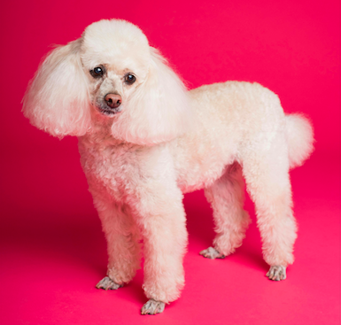</h1>


## Site User Goals

- Clients who are interested in high-end, luxury dog grooming for their pets
- A client who leads a busy life, and doesn't have time to fuss with a confusing website or make calls during working hours for their booking appointments
- A client who requires regular grooming and upkeep for their pet, from a basic nail trim, to a full groom

## Site Owner Goals

- To have a clear and easy to navigate website that streamlines the business and reduces emails and phone calls
- To allow the admin to update the services and groomers as required
- To safely handle sensitive client data in a safe, proffesional manner


### Colour Palette

The colour theme was chosen after researching several grooming salon websites, I knew I wanted white as the main background with a splash of a particular colour. I landed on pink after finding this image of a mini-poodle online.

<h1 align="center"></h1>

### Wireframes

I initially brainstormed with a pen and paper rough sketch wireframes, along with design concepts and ideas for my website. As mentioned, I wanted a sleek, high-end modern site with a burst pop of colour. I took my wireframes to Balsamiq to see them begin to come to life.

<h1 align="center"></h1>
<h1 align="center"></h1>

# UX

## Data Structure

<h1 align="center">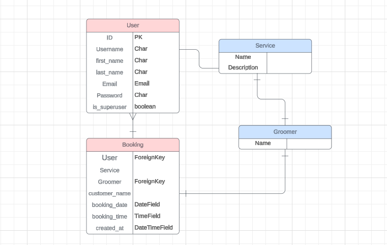</h1>

After deciding on the features for my project, I created a database structure schema to get an idea of how my data base and relationships between each type would work.

# Agile Development

Using GitHub Projects, I took on this project using Agile development methods to take each task one at a time and handle it in an organised manner. I found this method really wonderful for keeping track of where I was at in between working on the project.

## User Stories

Github projects was used to help me keep track of project features and to help me focus on each sprint. I created a kaban board for my user stories, and added the MoSCoW (Must have, Should have, Could have, Won't have) prioritization to my user stories.

<h1 align="center">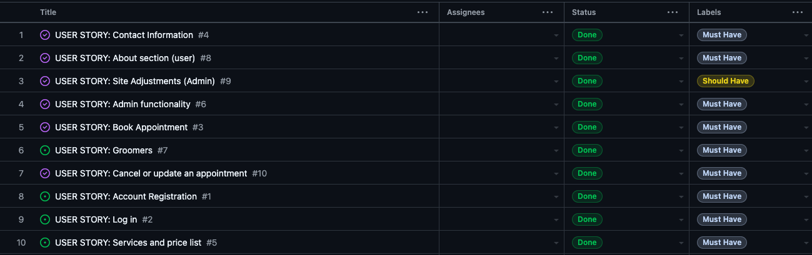</h1>
<h1 align="center">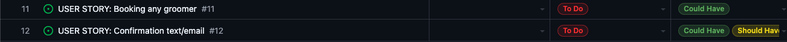</h1>

- USER STORY 1: Account Registration: As a Site User, I can register an account so that I can book in for grooming services.
- USER STORY 2: Log In: As a user, I can log in so that I can access my profile.
- USER STORY 3: Book Appointment: As a registered user, I want to create and book in my own appointments for my pet so that the process is easy and straightforward without the hassle of contacting the groomers directly.
- USER STORY 4: Contact Information: As a user, I want to view information regarding open hours, directions and contact information so that I understand where the location is and have their direct details should I need to contact them further.
- USER STORY 5: Services & Pricelist: As a user, I want to know what services are available, and what the cost is so that I know if the business can cater to my pet's needs.
- USER STORY 6: Admin Functionality: As an admin, I need to have CRUD access to database data so that I can make necessary changes with ease of access whenever I need.
- USER STORY 7: Groomers: As a user, I can see a list of the groomers to choose from, and read a blurb about them so that I can make a right choice in who can groom my pet.
- USER STORY 8: About: As a user, I can read about the grooming salon to get a feel for their business ethos to make sure it is a good fit for my pet.
- USER STORY 9: Site Adjustments: As a site admin, I can conveniently and easily make adjustments to the grooming service options available to book in the customer profile, and I can also update my groomers should I have any staff to add or remove.
- USER STORY 10: Update appointments: As a registered user, I want to cancel my own bookings, or update the day so that I can have a user-friendly experience with less hassle of having to contact the grooming salon directly each time.
- USER STORY 11: Book any groomer: As a user, I can make a booking with any groomer, none specified so that I don't have to make a choice if I don't know who to go with.
- USER STORY 12: Confirmation text/email: As a user, I can get a further confirmation outside of my client portal with a confirmation via email or text automatically sent.

# Features

All pages, except for the customer profile portal, can be viewed without registering for an account.

## Features Left To Implement

- Not to allow more than 1 booking on the same time/day; create a unique index on Groomer, Date & Time.
- Ability to edit/delete profile for the customer from their profile page
- User stories 11 & 12 - Ability to book any groomer and customer to receive a confirmation text/email about their appointment.

## Base HTML:

The header/nav bar and footer were created in a base file and loaded onto each page at the start of every file.

<h1 align="center"></h1>
<h1 align="center"></h1>

### Index page:

The home page (index) features a minimal header with a large hero image for visual impact. Under the hero image is a small about section and groomer profiles to give the client an idea of the salon, and also to help match them with the right groomer for their needs.

<h1 align="center"></h1>
<h1 align="center"></h1>
<h1 align="center"></h1>


## Services page

A section to explain how the booking appointments work, and what service option may suit the client and their pet. This page contains text explaining the options, as well as a structured pricing list depending on the dog's size.

<h1 align="center"></h1>
<h1 align="center"></h1>

## Contact page

The contact page gives all the necessary information for getting in touch: email, phone and a further booking link. It also has a google map showcasing the address and map location.

<h1 align="center"></h1>

## Booking page

The booking page can be accessed via several buttons I created which redirects the client to book in.

<h1 align="center"></h1>

## Customer profile

Once logged in, the customer can see any upcoming appointments and use CRUD functionality to update or delete future appointments.

<h1 align="center"></h1>

## Modals

<h1 align="center">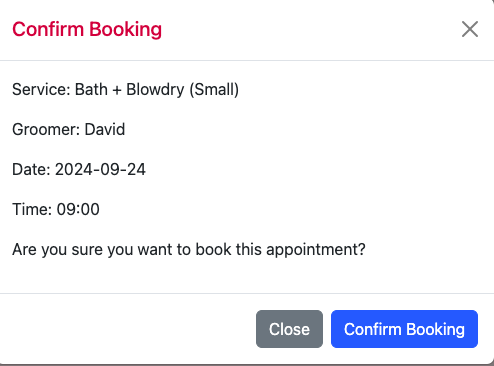</h1>
<h1 align="center">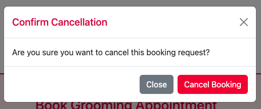</h1>

## Booking Confirmation

<h1 align="center">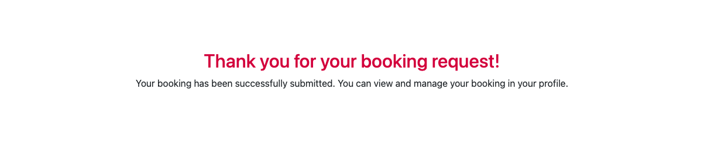</h1>


## Authentication

- User can sign up and create their own profile for bookings
- User can book their own appointments, view current appointments as well as managing them (CRUD Functionality)
- Safety ensured via [Django-AllAuth](https://github.com/pennersr/django-allauth) & csrf tokens

# Features Left To Be Implemented

- Profile information: edit/delete options
- Unique index on Groomer, Date & Time options to ensure someone isn't double booked


# Technology

- Html - for page structure
- CSS - Custom styling
- Python - Backend development
- Javascript - Pop up modals
- Django - Project Framework
- Heroku PostgreSQL - Database
- Font Awesome - Social icons
- Bootstrap 5 - Front end styling framework
- Google Fonts- Font styling
- GitHub - Code and Kaban
- Heroku - Hosting & Deployment


# Testing

- HTML Validation passed

<h1 align="center">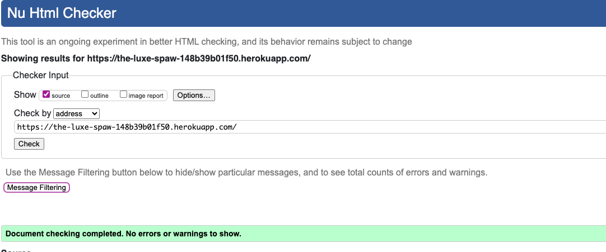</h1>

- CSS Validation passed:

<h1 align="center"></h1>

- Pep8 CI Linter passed (Example file):

<h1 align="center">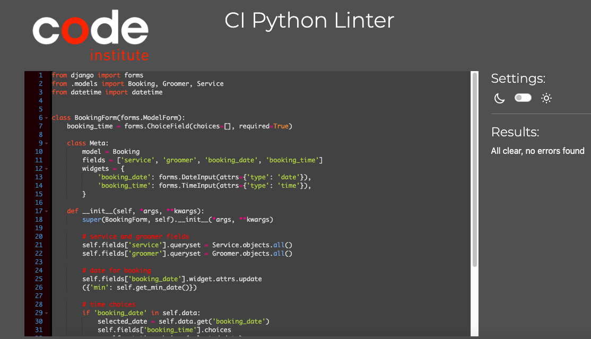</h1>


## Manual testing

Chrome DevTools was used during the development process to check and modify HTML and CSS styles used in the project.

### Account Registration

| Test |Result  |
|--|--|
| User can create a profile | Pass |
| User can log in | Pass |
| User can log out | Pass |
| Messages displaying | Pass |

### User Navigation Tests

| Test | Result  |
|--|--|
| User can navigate to Bookings in profile | Pass |
| User can access each page | Pass|
| SuperUser can access admin page|Pass|

#### Account Authorisation Tests

| Test | Result  |
|--|--|
| Only Superuser can access admin page |Pass|
| Non authorised user can't access profile or booking page| Pass|

#### Booking and Profile

| Test |Result  |
|--|--|
|User can make a booking | Pass |
|User can view upcoming bookings | Pass |
|User can delete any booking | Pass |
|User can update booking | Pass |
|User can make multiple bookings | Pass |
|User can see the confirmation information | Pass |

### Responsiveness

- The website is entirely responsive thanks to Bootstrap and media queries
- Hamburger navbar will display on smaller devices, and layout changes will update.

### Browser Testing

Browser | Outcome | Pass/Fail |
--- | --- | --- |
Google Chrome | No issues found (appearance/responsiveness)| Pass |
Safari |  No issues found (appearance/responsiveness) | Pass |
Mozilla Firefox |  No issues found (appearance/responsiveness)| Pass |
Microsoft Edge |  No issues found (appearance/responsiveness) | Pass |

### Lighthouse Testing 

<h1 align="center">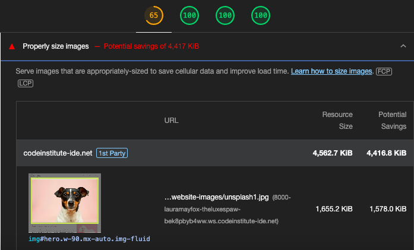</h1>
<h1 align="center"></h1>

- Lighthouse testing initially showed me my first option colour palette would not work due to accessibility issues, so I increased the contrast and got a great result.
- Performance issues appeared which seemed to be in relation to my hero image. For a future deployment this is something I would amend to improve and bring up the overall performance.


### Known Issues & Bugs

- There is an error I found during testing that if there are blank inputs the modal appears. Fortunately, when you click to book, the required field warnings come up on each field, but something to fix for future deployment.

<h1 align="center">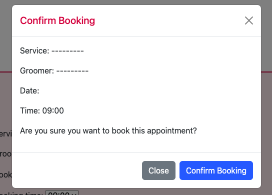</h1>

- Another bug I found during testing was when you are in the customer profile portal and click to update a booking, if you click 'cancel' a modal bug flashes momentarily before returning to the customer portal. I did not have time to rectify this issue, but something to fix for future deployment.


# Deployment

> Heroku app

- Sign up or Log in to Heroku
- On the Dashboard page select 'New', then 'Create New App'
- Name the project (In this case, The Luxe Spaw)
- Select EU (or whatever region you are in)
- Select "Create App"
- On the "Deploy" tab choose GitHub
- Connect your GitHub account or repository

> enviroment variables

- Go to Django app editor and create env.py in the top level
- In env.py import os
- In env.py, set up necessary enviroment variables:
  - add a secret key using: os.environ['SECRET_KEY'] = 'your secret key'
  - for the database variable the line should include os.environ['DATABASE_URL']= 'Paste the database link in here'
  - in settings.py replace value of SECRET_KEY variable with os.environ.get('SECRET_KEY')
  - in settings.py change the value of DATABASES variable to 'default': dj_database_url.parse(os.environ.get("DATABASE_URL"))
- In Django app's settings.py on top of the file add:
```
from pathlib import Path
import os
import dj_database_url
if os.path.isfile('env.py'):
    import env
```
- Go to "Settings" tab in Heroku
- Open "Config Vars" section and add DATABASE_URL as Key and the database link from app's env.py as Value
- Add SECRET_KEY for the Key value and the secret key value from env.py as the Value
- In the terminal migrate the models over to the new database connection
- In settings.py add the STATIC files settings as follows:
```
STATIC_URL = '/static/'
STATICFILES_DIRS = [os.path.join(BASE_DIR, 'static')]
STATIC_ROOT = os.path.join(BASE_DIR, "staticfiles")
```
- Change the templates directory in settings.py to: TEMPLARES_DIR = os.path.join(BASE_DIR, 'templates')
- In TEMPLATES variable change the 'DIRS' key to look like this: 'DIRS': [TEMPLARES_DIR],
- Add Heroku to the ALLOWED_HOSTS list (the format will be your-app-name.herokuapp.com, you can copy it from the Domains section in Settings tab in your Heroku app)
- If you haven't done that up to this point, then create in your Django app's code editor new top level folders: static and templates
- Create a new file on the top level directory - Procfile
- Within the Procfile, add:
```
web: guincorn PROJECT_NAME.wsgi
``` 
- In the terminal, add the changed files, commit and push to GitHub

> Heroku deployment

- In Heroku, navigate to the Deployment tab and deploy the branch manually 
- Heroku will display a build log- watch the build logs for any errors
- Once the build process is completed, Heroku displays 'Your App Was Successfully Deployed'
- You can then navigate to the live app link via the link at the bottom or top of the page

#### Forking the repository

- Log in to GitHub/create an account
- Enter this [repository link](https://github.com/lauramayfox/the-luxe-spaw)
- Select "Fork" from the top of the repository
- A copy of the repository will be created in your own repository


# Credits

# Resources

- Initial project set up & AllAuth section followed along from 'I Think, Therefore I Blog' tutorial
- [W3SCHOOLS](https://w3schools.com/) - General source of info & troubleshooting resource
- [STACK OVERFLOW](https://stackoverflow.com/) - General source of info & troubleshooting resource
- [Modal Tutorial - YouTube](https://www.youtube.com/watch?v=87Hj55vCVz8&t=2144s) - Resource to help
understand & set up my booking modals.
- [Booking System Walkthrough - DevGenius](https://blog.devgenius.io/django-tutorial-on-how-to-create-a-booking-system-for-a-health-clinic-9b1920fc2b78) - Health clinic booking
system text tutorial walkthrough as a helpful resource for CRUD functionality on my project.

### Media

- Royalty free images from [Unsplash](https://unsplash.com/) & [Pexels](https://pexels.com/)
- Site logo & favicon designed and made by me
- The mockup image at the beginning of this file was created using [Am I Responsive](http://ami.responsivedesign.is/).
- Text sections derived from [OpenAI](https://openai.com/dall-e-2).

### Acknowledgements

- I first off want to thank my family for their constant support & love, thank you for believing in me.
- I want to thank my mentor, Excellence, for his all of his support and guidance throughout the course so far.
- Thanks to the Code Institute staff; student support, my cohort leader Kamil, and the tutoring service for being fantastic pilars of support over the last year.

